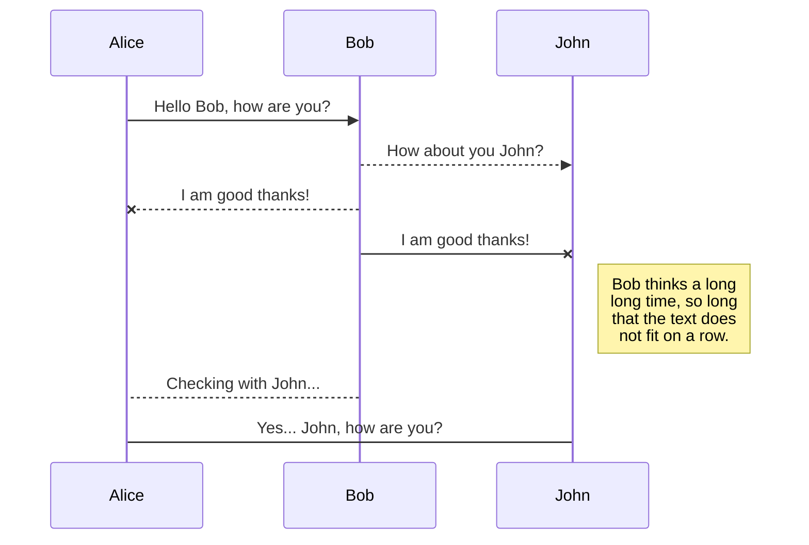
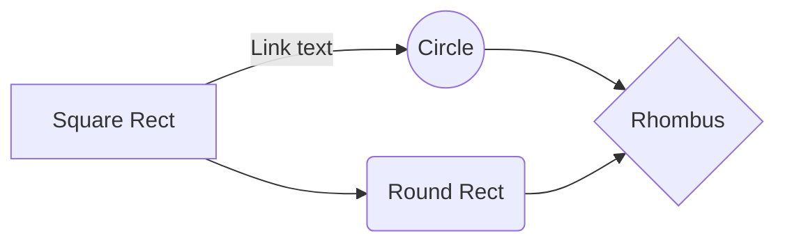

# Operacion Fuego de Quasar

API que permite decodificar mensajes interceptados de una nave imperial pidiendo auxilio.


# Como probarlo?

La solucion se encuentra hosteada en Amazon Web Services, para consumir la api se debera tener en cuenta la siguiente informacion:
-  **Endpoint:** http://ec2-3-19-141-132.us-east-2.compute.amazonaws.com:8080
- **Serivicios disponibles:**
		- **POST** /api/topsecret   ->  Decodifica el mensaje y la ubicacion segun informacion obtenida en Satelites
		- **POST** /api/topsecret_split/{satelite_name}  ->  Se inserta un mensaje y distancia en cada Satelite de a uno a la vez.
		- **GET** /api/topsecret_split/  ->  Se obtiene lo instertado en el servicio anterior.
		- **GET** /api/{satelite_name}/  ->  Obtiene un Satelite segun nombre
		- **PUT** /api/updatePosition  ->  Actualiza la posicion original de un Satelite


Para mayor agilidad, se podra encontrar el archivo **FuegoQuasar.postman_collection.json** con ejemplos de cada request.
```

```

```

```


## Diagrama de clases

A continuacion se detalla el diagrama de clases de la solucion, indicando las clases involucradas y sus metodos mas significativos:

```

```


## Diagramas de flujo

You can render UML diagrams using [Mermaid](https://mermaidjs.github.io/). For example, this will produce a sequence diagram:



And this will produce a flow chart:


